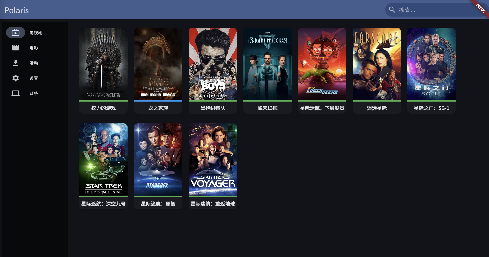
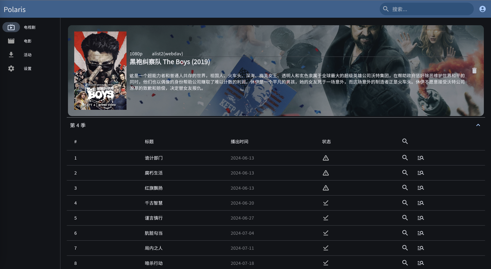

# polaris

Polaris 是一个电视剧和电影的追踪软件。配置好了之后，当剧集或者电影播出后，会第一时间下载对应的资源。支持本地存储或者webdav。




## 快速开始

最简单部署 Polaris 的方式是使用 docker compose

```yaml
  polaris:
    image: ghcr.io/simon-ding/polaris:latest
    restart: always
    volumes:
      - ./config/polaris:/app/data #程序配置文件路径
      - /downloads:/downloads #下载路径，需要和下载客户端配置一致
      - /data:/data #数据存储路径
    ports:
      - 8080:8080
```

拉起之后访问 http://< ip >:8080 的形式访问

## 配置

要正确使用此程序，需要配置好3个东西：

### 索引器

索引器是资源提供者，目前支持 torznab 协议，意味着 polarr 或者 jackett 都可以支持。请自行部署相关程序。

推荐使用 linuxserver 的镜像：https://docs.linuxserver.io/images/docker-jackett/

### 下载器

资源由谁下载，目前可支持 tansmission，需要配置好对应下载器

### 存储设置

程序默认所有剧集和电影存储在 /data 路径下，如果想修改路径或者webdav存储，需要在存储配置下修改

## 开始使用

配置完了这些，开始享受使用此程序吧！可以搜索几部自己想看的电影或者电视机，加入想看列表。当剧集有更新或者电影有资源是就会自动下载对应资源了。


-------------

## 请我喝杯咖啡

