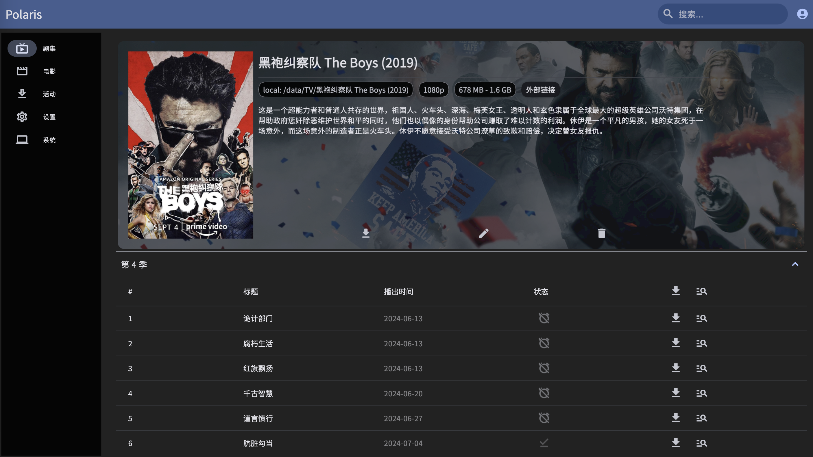
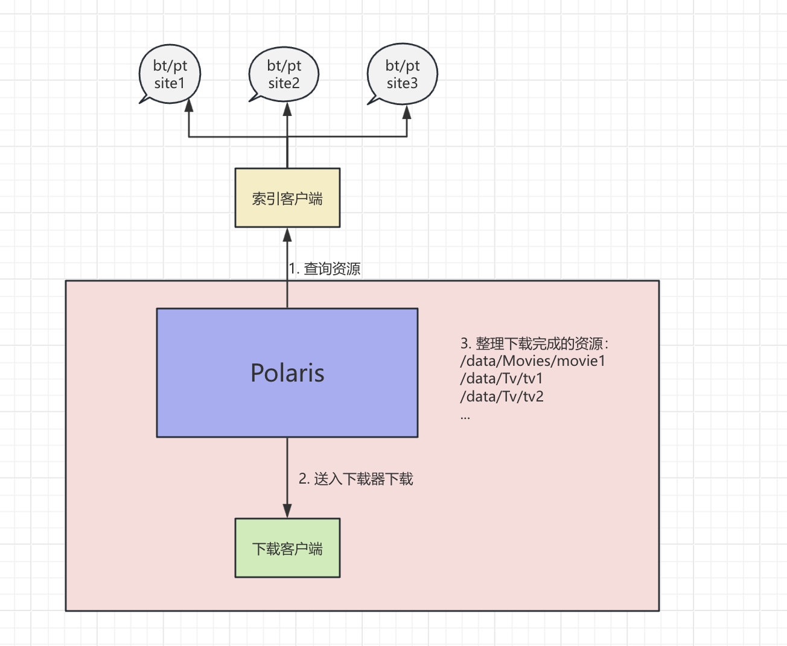

<h1 align="center">Polaris</h1>

**Polaris 是一个电视剧和电影的追踪下载软件。对美剧动漫日剧都有良好的匹配，支持多种存储方式（webdav、alist、本地存储）。**

交流群： https://t.me/+8R2nzrlSs2JhMDgx

## 快速开始

使用此程序参考 [【快速开始】](./doc/quick_start.md)

## Features

- [x] 电视剧自动追踪下载
- [x] 电影自动追踪下载
- [x] 本地、webdav、  [alist](https://github.com/alist-org/alist) 存储支持，使用 alist 存储支持秒传功能
- [x] 事件通知推送，目前支持 Pushover和 Bark，还在扩充中
- [x] TMDB 代理支持
- [x] 用户认证
- [x] plex 刮削支持
- [x] NFO 刮削文件支持
- [x] BT/PT 支持
- [x] qbittorrent/transmission客户端支持
- [x] 支持导入plex watchlist，plex里标记，自动导入polaris
- [x] and more...

## Todos

- [ ] 更多通知客户端支持
- [ ] 更多第三方watchlist导入支持
- [ ] 手机客户端

## 截图

## 运行原理

Polaris本身不提供任何资源，要使其能正常工作，需要同时安装一个下载客户端（transmission）和一个索引客户端（jackett）。

Polaris通过索引客户端查询相关的BT/PT站点，然后把查到的资源送到下载器，等待下载器下载完成对应资源。下载完成后，根据下载的对应资源，整理到对应的文件夹里去

<!-- ## 对比 sonarr/radarr
* 更好的中文支持
* 对于动漫、日剧的良好支持，配合国内站点基本能匹配上对应资源
* 支持 webdav 后端存储，可以配合 alist 或者阿里云来实现下载后实时传到云上的功能。这样外出就可以不依靠家里的宽带来看电影了，或者实现个轻 NAS 功能，下载功能放在本地，数据放在云盘
* golang 实现后端，相比于 .NET 更节省资源
* 一个程序同时实现了电影、电视剧功能，不需要装两个程序
* 当然 sonarr/radarr 也是非常优秀的开源项目，目前 Polaris 功能还没有 sonarr/radarr 丰富 -->

## Stargazers over time

-------------

## 请我喝杯咖啡

