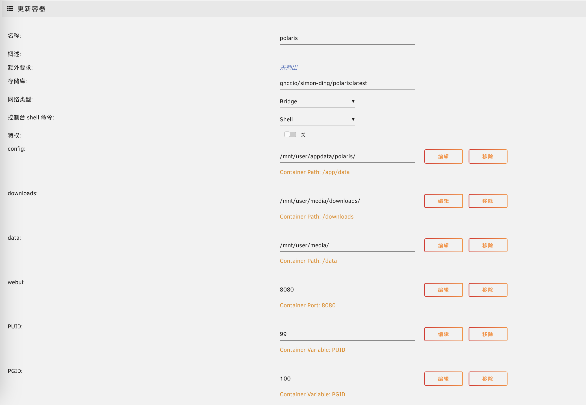

# 快速开始

## 安装 Polaris

### Docker Compose 方式安装

最简单使用本程序的方式是通过docker compose，下面内容保存成 docker-compose.yml，然后执行 docker compose up -d, 即可拉起程序。

```yaml
services:
  polaris:
    image: ghcr.io/simon-ding/polaris:latest
    restart: always
    environment:
      - PUID=99
      - PGID=100
      - TZ=Asia/Shanghai
    volumes:
      - <配置文件路径>:/app/data #程序配置文件路径
      - <下载路径>:/downloads #下载路径，需要和下载客户端配置一致
      - <媒体文件路径>:/data #媒体数据存储路径，也可以启动自己配置webdav存储
    ports:
      - 8080:8080
```

### Docker 方式安装

也可以通过原始 docker 命令的方式安装 Polaris：

```bash
docker run -d \
    -v <配置文件路径>:/app/data \
    -v <下载路径>:/downloads \
    -v <媒体文件路径>:/data \
    -e PUID=99 \
    -e PGID=100 \
    -e TZ=Asia/Shanghai \
    -p 8080:8080 \
    --restart always \
    ghcr.io/simon-ding/polaris:latest
```

### Unraid 安装

参考下图进行配置



### 访问
拉起之后访问 http://< ip >:8080 即可访问 Polaris 的主页：


## 安装下载客户端

Polaris 需要下载客户端的配合使用，目前支持 Transmission 和 Qbittorrent。推荐使用linuxserver镜像进行安装

 * [linuxserver/transmission](https://docs.linuxserver.io/images/docker-transmission)

 * [linuxserver/qbittorrent](https://docs.linuxserver.io/images/docker-qbittorrent/)

需要注意的是下载客户端内 /downloads 路径的映射地址要和 Polaris的/downloads路径映射保持一致。也就是说他俩都要映射到同一路径。

## 安装 Jackett
Polaris 如果要正常工作，还需要一个索引客户端的支持，目前支持jackett索引客户端。

安装方式见：

 * [linuxserver/jackett](https://docs.linuxserver.io/images/docker-jackett/)


## 联合安装

如果觉得一个个安装麻烦，也可以使用下面docker compose文件，一键拉起所有组件

 **注意：** transmission 的下载路径映射要和 polaris 保持一致，如果您不知道怎么做，请保持默认设置。

```yaml
services:
  polaris:
    image: ghcr.io/simon-ding/polaris:latest
    restart: always
    environment:
      - PUID=1000
      - PGID=1000
      - TZ=Asia/Shanghai
    volumes:
      - ./config/polaris:/app/data #程序配置文件路径
      - /downloads:/downloads #下载路径，需要和下载客户端配置一致
      - /data:/data #媒体数据存储路径，也可以启动自己配置webdav存储
    ports:
      - 8080:8080
  transmission:    #下载客户端，也可以不安装使用已有的
    image: lscr.io/linuxserver/transmission:latest
    environment:
      - PUID=1000
      - PGID=1000
      - TZ=Asia/Shanghai
    volumes:
      - ./config/transmission:/config
      - /downloads:/downloads #此路径要与polaris下载路径保持一致
    ports:
      - 9091:9091
      - 51413:51413
      - 51413:51413/udp
  jackett:      #索引客户端，也可以不安装使用已有的
    image: lscr.io/linuxserver/jackett:latest
    environment:
      - PUID=1000
      - PGID=1000
      - TZ=Asia/Shanghai
    volumes:
      - ./config/jackett:/config
    ports:
      - 9117:9117
    restart: unless-stopped
```

复制上面文件保存成 docker-compose.yml 文件，然后执行下面命令

```bash
docker compose up -d
```


## 配置

详细配置请看 [配置篇](./configuration.md)


